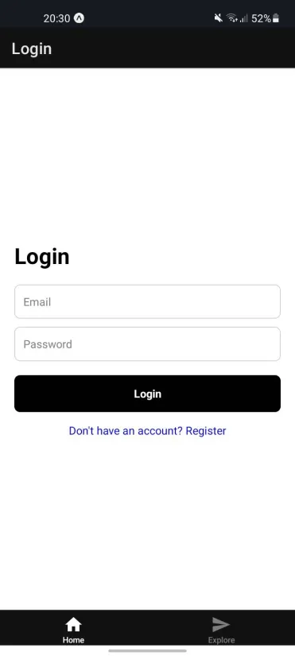
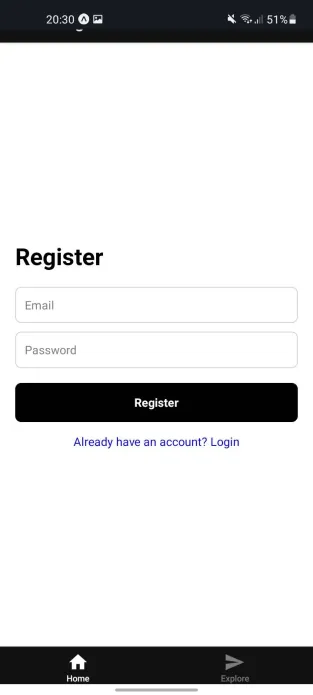
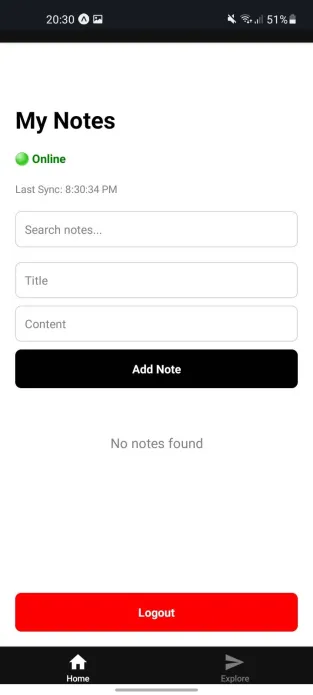
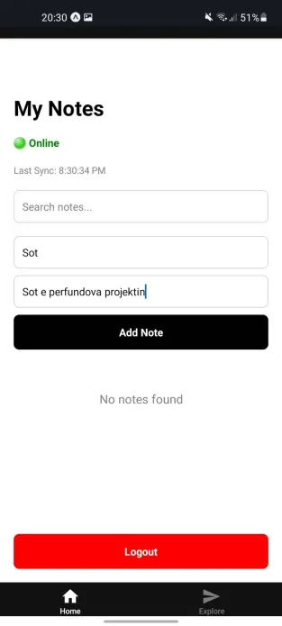
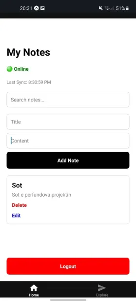
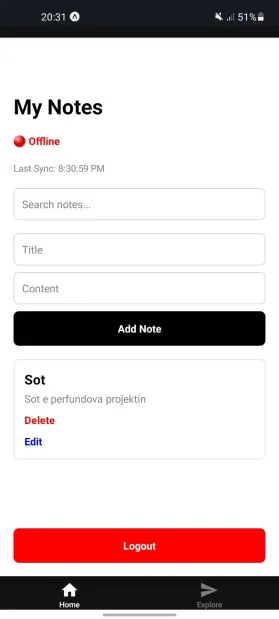
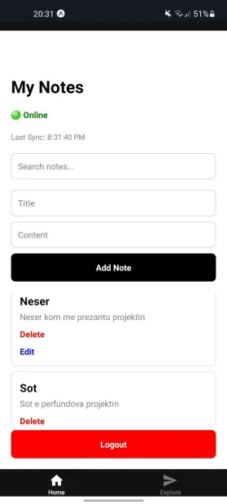
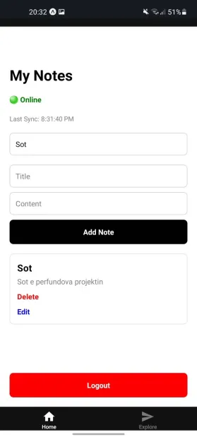
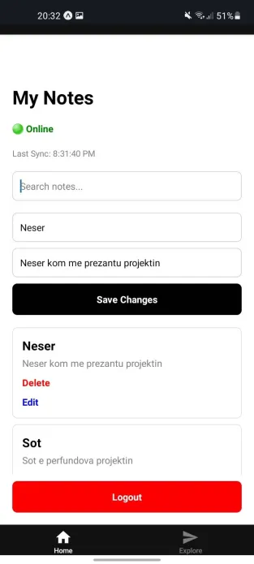

# Mobile Cloud Notes App

A React Native mobile cloud computing application with Firebase backend, offline cache, synchronization, and conflict handling support.

---

# Features

- User Authentication (Firebase Auth)
- Cloud Database (Firestore)
- Create, Edit, Delete Notes
- Offline Cache Support
- Automatic Cloud Synchronization
- Network Status Monitoring
- Search Notes
- Local Storage Support
- Conflict Handling using Last Write Wins strategy
- Sync Metadata Tracking

---

# Tech Stack

## Mobile Frontend
- React Native
- Expo
- TypeScript

## Cloud Backend
- Firebase Authentication
- Firebase Firestore Database

## Mobile Cloud Computing Features
- Offline-first architecture
- Cloud synchronization
- Local cache
- Network monitoring
- Automatic sync recovery

---

# Installation

## Clone repository

```bash
git https://github.com/Endritfx/Mobile-Notes
```

## Install dependencies

```bash
npm install
```

## Start project

```bash
npx expo start
```

---

# Testing

## Local Testing

- Login/Register works
- Notes CRUD works
- Offline cache works
- Search works
- Network monitoring works

## MCC Testing

- Disable internet connection
- Open notes from local cache
- Re-enable internet
- Automatic synchronization restores cloud sync

---

# Synchronization Strategy

The application uses:
- Local cache with AsyncStorage
- Firebase Firestore cloud synchronization
- Last Write Wins conflict handling strategy
- Automatic sync recovery after reconnection

---

# Screenshots

## Login Screen


## Register Screen


## Notes Dashboard


## Write Note


## Dalja e Notes


## Offline Mode


## 2 Notes


## Search


## Edit Notes


---

# Live Web Demo

https://mobile-n0tes.web.app/

---

# Author

Endrit Demiri
